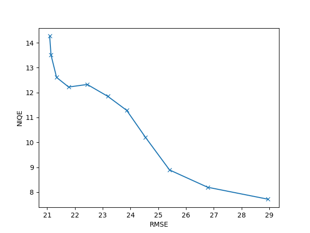

# dni-demo
## Introduction
A demonstration of Deep Network Interpolation[1] for SR application.
I use pretrained SRGAN/ESRGAN provided by [MMSR](https://github.com/open-mmlab/mmsr)[2].

## Requirements
see [Pipfile](./Pipfile)

## Usage
```shell
python main.py --input path/to/your/image
```

## Sample result
The interpolation result on Set14[3] `baboon` is here!


The Perception-Distortion Tradeoff[4] was observed.



## Reference
1. Wang, Xintao, et al. "Deep network interpolation for continuous imagery effect transition." Proceedings of the IEEE Conference on Computer Vision and Pattern Recognition. 2019.
1. MMSR from Multimedia Laboratory, CUHK.- https://github.com/open-mmlab/mmsr
1. Bevilacqua, Marco, et al. "Low-complexity single-image super-resolution based on nonnegative neighbor embedding." (2012): 135-1.
1. Blau, Yochai, and Tomer Michaeli. "The perception-distortion tradeoff." Proceedings of the IEEE Conference on Computer Vision and Pattern Recognition. 2018.