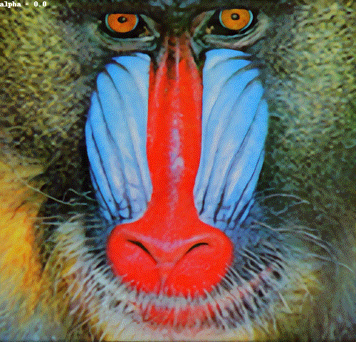

# dni-demo
## Introduction
A demonstration of Deep Network Interpolation[1][2] for SR application.
I use pretrained MSRResNet/MSRGAN provided by [MMSR](https://github.com/open-mmlab/mmsr).

## Requirements
- Python 3.7.4
- torch 1.3.1
- torchvision 0.4.1
- googledrivedownloader
- requests

see also: [Pipfile](./Pipfile)

## Usage
```shell
python main.py --input path/to/your/image
```

## Sample result
The interpolation result on Set14[4] `baboon` here!



## Reference
1. Wang, Xintao, et al. "Deep network interpolation for continuous imagery effect transition." Proceedings of the IEEE Conference on Computer Vision and Pattern Recognition. 2019.
1. The original repo by [xinntao](https://github.com/xinntao) - https://github.com/xinntao/DNI
1. MMSR from Multimedia Laboratory, CUHK.- https://github.com/open-mmlab/mmsr
1. Bevilacqua, Marco, et al. "Low-complexity single-image super-resolution based on nonnegative neighbor embedding." (2012): 135-1.